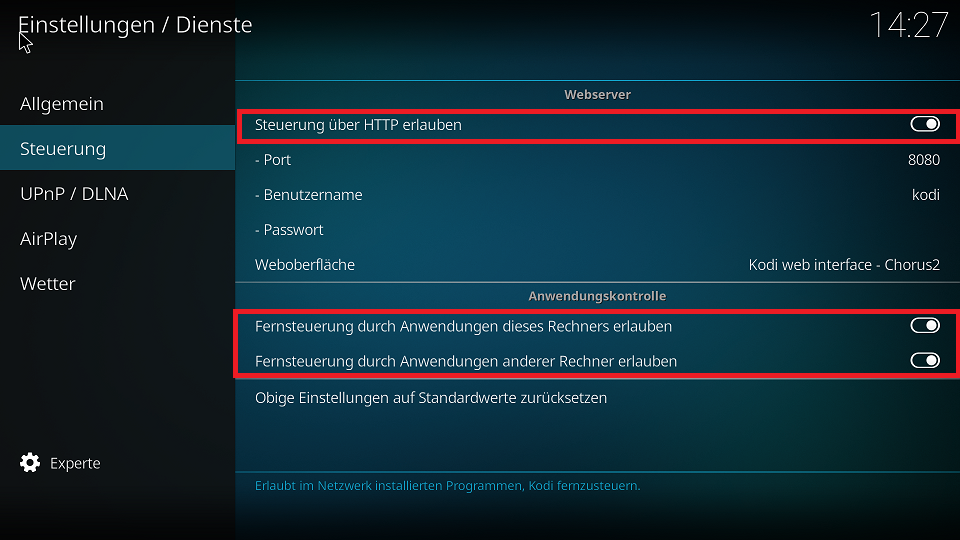
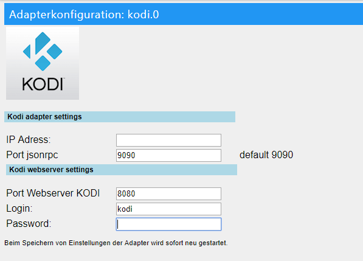

Mit diesem Adapter kann ein Kodi Client über ioBroker verwaltet und gesteuert werden. Informationen aus dem Kodi Client werden in ioBroker als Objekte angezeigt.

# Kodi's JSON-RPC-API
Dieser Adapter nutzt Kodi's JSON-RPC-API. Die offizielle Kodi Dokumentation der API ist [hier](http://kodi.wiki/view/JSON-RPC_API) und die vollständige Liste der verfügbaren Befehle (für V6) ist [hier](http://kodi.wiki/view/JSON-RPC_API/v6) zu finden.

***Hinweis: Dieser Adapter benötigt Node größer 0.12***

## Kodi Konfiguration
Im Hauptmenü von Kodi in der linken Menüspalte ganz oben über das Zahnradsymbol die Systemeinstellungen öffnen. Über Dienste dann Steuerung auswählen und `Steuerung über HTTP erlauben`, `Fernsteuerung durch Anwendungen dieses Rechners erlauben` und `Fernsteuerung durch Anwendungen anderer Rechners erlauben` auswählen.



## Adapterkonfiguration
**IP-Adresse:** vom Kodi System eintragen.

**Port jsonrpc:** voreingestellt auf 9090.

**Port Webserver KODI:** voreingestellt ist 8080, entsprechend der Einstellung in der Kodi Konfiguration

**Login:** entsprechend der Einstellung in der Kodi Konfiguration

**Password:** entsprechende der Einstellung in der Kodi Konfiguration




Die JSON-RPC-API verwendet den Port 9090. Fall dieser Port geändert werden soll, muss im Kodi System die Datei advancedsettings.xml erstellt werden. [Hier](http://kodi.wiki/view/AdvancedSettings.xml) nachsehen unter welchem Verzeichnis diese Datei abgelegt werden muss. Die Datei muss folgenden Inhalt haben: 

```xml
<jsonrpc>
    <compactoutput>true</compactoutput>
    <tcpport>9999</tcpport>
</jsonrpc>
```
Port 9999 ist nur als Beispiel gewählt.

## Nutzung einzelner Objekte:
### ShowNotif:
Один важный момент, если используется заголовок сообщения, то он должен всегда находится перед самим текстом сообщения (Внимание;Протечка воды), расположение остальных параметров не критично.

**Image:**
Nachrichtenebene
  * 'info' - 0 (default),
  * 'warning' - 1,
  * 'error' - 2.

**displaytime:**
Meldungsanzeigezeit einstellbar von 1.500 bis 30.000ms.

**Beispiel:**
 * 1;Внимание;Протечка воды;15000
 * Внимание;Протечка воды;2;10000
 * Внимание;Протечка воды
 * Протечка воды

Es können auch Nachrichten vom javascript Adapter gesendet werden:
```js
sendTo("kodi.0", {
    message:  'Возможно протечка воды ', //Текст сообщения
    title:    'ВНИМАНИЕ!!!', //Заголовок сообщения
    image: 'https://raw.githubusercontent.com/instalator/ioBroker.kodi/master/admin/kodi.png', //Ссылка на иконку
    delay: 7000 //Время отображения сообщения милисекундах (минимум 1500 макс 30000 мс)
});
```
### SwitchPVR:
Umschalten von PVR IPTV-Kanälen anhand des Kanalnamens in der Wiedergabeliste.
**Beispiel:** Fernsehsender - Discovery Science findet sowohl mit vollem Namen als auch mit entdecken,


### Youtube:
Bei installierten YouTube Addon in Kodi reicht es aus, den Videocode in diesem Feld einzutragen und die Wiedergabe startet.

Beispiel: Um dieses [Video](https://www.youtube.com/watch?v=SNd9h5eTSA4) zu öffnen, muss SNd9h5eTSA4 eingesetzt werden.

### Open:
Hier kann ein Link zu Inhalten im Internet oder der Pfad zu einer lokalen Mediendatei hinterlegt werden.
Nachdem der Wert geschrieben wurde, beginnt der Kodi-Player mit der Wiedergabe.

### Position:
Zeigt aktuellen Titel der Wiedergabeliste.

### Seek:
Zeigt die aktuelle Wiedergabeposition von 0 bis 100%.

### Repeat:
Wiederholt die Wiedergabe und mit folgenden Werte:
* off - Reapeat deaktiviert
* on - Wiederholt die Wiedergabe des aktuellen Titels
* all - Wiederholt alle Wiedergabelisten

### Shuffle:
Zufällige Wiedergabe der Wiedergabeliste starten

### Play:
Startet die Wiedergabe

### Speed:
Die Wiedergabegeschwindigkeit kann hier mit folgenden Werten eingestellt werden:
-32, -16, -8, -4, -2, -1, 0, 1, 2, 4, 8, 16, 32

### Directory:
Der Pfad zum Ordner oder Laufwerk wird hier angezeigt.

### ActivateWindow:
Steuert das Playerfenster. Folgende Befehle können damit gesendet werden:
```
"home", "programs", "pictures", "filemanager", "files", "settings", "music", "video", "videos", "tv", "pvr", "pvrguideinfo", "pvrrecordinginfo", "pvrtimersetting", "pvrgroupmanager", "pvrchannelmanager", "pvrchannelmanager", "pvrguidesearch", "pvrchannelscan", "pvrupdateprogress", "pvrosdchannels", "pvrosdguide", "pvrosddirector", "pvrosdcutter", "pvrosdteletext", "systeminfo", "testpattern", "screencalibration", "guicalibration", "picturessettings", "programssettings", "weathersettings", "musicsettings", "systemsettings", "videossettings", "networksettings", "servicesettings", "appearancesettings", "pvrsettings", "tvsettings", "scripts", "videofiles", "videolibrary", "videoplaylist", "loginscreen", "profiles", "skinsettings", "addonbrowser", "yesnodialog", "progressdialog", "virtualkeyboard", "volumebar", "submenu", "favourites", "contextmenu", "infodialog", "numericinput", "gamepadinput", "shutdownmenu", "mutebug", "playercontrols", "seekbar", "musicosd", "addonsettings", "visualisationsettings", "visualisationpresetlist", "osdvideosettings", "osdaudiosettings", "videobookmarks", "filebrowser", "networksetup", "mediasource", "profilesettings", "locksettings", "contentsettings", "songinformation", "smartplaylisteditor", "smartplaylistrule", "busydialog", "pictureinfo", "accesspoints", "fullscreeninfo", "karaokeselector", "karaokelargeselector", "sliderdialog", "addoninformation", "musicplaylist", "musicfiles", "musiclibrary", "musicplaylisteditor", "teletext", "selectdialog", "musicinformation", "okdialog", "movieinformation", "textviewer", "fullscreenvideo", "fullscreenlivetv", "visualisation", "slideshow", "filestackingdialog", "karaoke", "weather", "screensaver", "videoosd", "videomenu", "videotimeseek", "musicoverlay", "videooverlay", "startwindow", "startup", "peripherals", "peripheralsettings", "extendedprogressdialog", "mediafilter".
```

### ExecuteAction:
Folgende Befehle können übermittelt werden:
```
"left", "right", "up", "down", "pageup", "pagedown", "select", "highlight", "parentdir", "parentfolder", "back", "previousmenu", "info", "pause", "stop", "skipnext", "skipprevious", "fullscreen", "aspectratio", "stepforward", "stepback", "bigstepforward", "bigstepback", "osd", "showsubtitles", "nextsubtitle", "codecinfo", "nextpicture", "previouspicture", "zoomout", "zoomin", "playlist", "queue", "zoomnormal", "zoomlevel1", "zoomlevel2", "zoomlevel3", "zoomlevel4", "zoomlevel5", "zoomlevel6", "zoomlevel7", "zoomlevel8", "zoomlevel9", "nextcalibration", "resetcalibration", "analogmove", "rotate", "rotateccw", "close", "subtitledelayminus", "subtitledelay", "subtitledelayplus", "audiodelayminus", "audiodelay", "audiodelayplus", "subtitleshiftup", "subtitleshiftdown", "subtitlealign", "audionextlanguage", "verticalshiftup", "verticalshiftdown", "nextresolution", "audiotoggledigital", "number0", "number1", "number2", "number3", "number4", "number5", "number6", "number7", "number8", "number9", "osdleft", "osdright", "osdup", "osddown", "osdselect", "osdvalueplus", "osdvalueminus", "smallstepback", "fastforward", "rewind", "play", "playpause", "delete", "copy", "move", "mplayerosd", "hidesubmenu", "screenshot", "rename", "togglewatched", "scanitem", "reloadkeymaps", "volumeup", "volumedown", "mute", "backspace", "scrollup", "scrolldown", "analogfastforward", "analogrewind", "moveitemup", "moveitemdown", "contextmenu", "shift", "symbols", "cursorleft", "cursorright", "showtime", "analogseekforward", "analogseekback", "showpreset", "presetlist", "nextpreset", "previouspreset", "lockpreset", "randompreset", "increasevisrating", "decreasevisrating", "showvideomenu", "enter", "increaserating", "decreaserating", "togglefullscreen", "nextscene", "previousscene", "nextletter", "prevletter", "jumpsms2", "jumpsms3", "jumpsms4", "jumpsms5", "jumpsms6", "jumpsms7", "jumpsms8", "jumpsms9", "filter", "filterclear", "filtersms2", "filtersms3", "filtersms4", "filtersms5", "filtersms6", "filtersms7", "filtersms8", "filtersms9", "firstpage", "lastpage", "guiprofile", "red", "green", "yellow", "blue", "increasepar", "decreasepar", "volampup", "volampdown", "channelup", "channeldown", "previouschannelgroup", "nextchannelgroup", "leftclick", "rightclick", "middleclick", "doubleclick", "wheelup", "wheeldown", "mousedrag", "mousemove", "noop".

```
### System:
 - EjectOpticalDrive - Entfernt oder schließt ein evtl. vorhandenes optische Laufwerk
 - Hibernate - Versetzt das System, auf dem Kodi ausgeführt wird, in den Ruhezustand
 - Reboot -  Startet das System, auf dem Kodi ausgeführt wird, neu
 - Shutdown - Fährt das System, auf dem Kodi ausgeführt wird, herunter
 - Suspend - Unterbricht das System, auf dem Kodi ausgeführt wird
